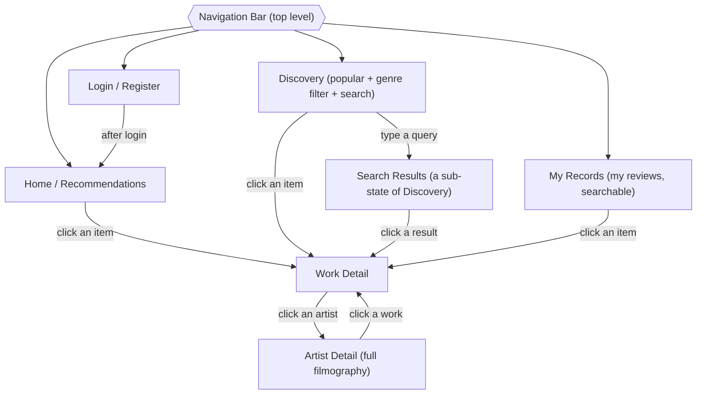

# Frontend Build Spec & API Contract

*Self-contained contract for building the React frontend. The frontend talks to the backend **only** over the HTTP endpoints below — you do not have, and do not need, access to the backend source. Everything required to build the UI is in this document.*

> ⚠️ **Response shapes below are the contract.** They must match exactly. Before building, hit each endpoint once (e.g. in Postman) against the running backend and confirm the JSON — if anything here differs from the live response, the **live response wins** and this doc should be corrected.

---

## 0. Ground rules for the frontend build

- **Build only the React SPA.** The API is fixed; do not assume or invent endpoints. If a screen needs data no listed endpoint provides, **stop and flag it** rather than guessing a URL.
- **Base URL** is configurable via an env var (e.g. `VITE_API_BASE_URL`), default `http://localhost:8000`. Never hardcode the host.
- **All paths below are relative to the base URL** and start with `/api/`.
- **Media types** are exactly: `"movie"`, `"tv"`, `"book"`.
- Treat every list as possibly empty; treat `average_rating` and other nullable fields as possibly `null`.

---

## 1. Authentication

Token-based. There are no sessions or cookies.

1. **Log in:** `POST /api/token/` with `{"username", "password"}` → `{"token": "<string>"}`.
2. **Store the token** (in memory or localStorage) and send it on every authenticated request as a header:
   ```
   Authorization: Token <the-token-string>
   ```
   Note the prefix is the word `Token` (a space, then the value) — not `Bearer`.
3. **Log out:** drop the stored token client-side. (No server logout endpoint yet — see §5.)

**Which endpoints need the token:**

| Area | Auth |
|---|---|
| `POST /api/token/` | none (this is how you get the token) |
| Catalog reads (detail, reviews, popular, search), Artist, `POST /select/` | **none** — public browsing |
| Recommendations (`/recommendations/`, `/recommendations/pick/`) | **required** |
| My reviews (`/api/reviews/...` all methods) | **required** |

A request that needs auth but has no/invalid token returns **401**. The frontend should treat 401 as "not logged in" (redirect to login).

---

## 2. Navigation & Page Flow



- **Four top-level pages** via a nav bar. **Work Detail** is the shared hub reached from every list. **Artist Detail ↔ Work Detail** loop.
- **Search Results is a state of Discovery**, driven by a query param (e.g. `/discovery?q=…`), not a separate nav page.

---

## 3. Endpoints (the contract)

Each response shape is JSON. Reusable shapes are defined once and referenced.

### Reusable shapes

**`Work`** (full work detail):
```json
{
  "id": 42,
  "title": "Inception",
  "media_type": "movie",
  "release_year": 2010,
  "pages": null,
  "runtime": 148,
  "episodes": null,
  "cover_url": "https://image.tmdb.org/t/p/w500/...",
  "description": "…",
  "genres": ["Science Fiction", "Action"],
  "average_rating": 4.3,
  "credits": {
    "directors": [{ "id": 5, "name": "Christopher Nolan", "profile_url": "https://…" }],
    "actors":    [{ "id": 6, "name": "Leonardo DiCaprio", "profile_url": "https://…" }],
    "authors":   []
  }
}
```
`genres` is a list of names (strings). `average_rating` is a number or `null`. `credits` groups are lists of `Artist` (id / name / profile_url). Medium-specific fields are `null` when not applicable (a movie has no `pages`/`episodes`).

**`SlimWork`** (search results, popular film/tv and each filmography item):
```json
{
  "external_id": "27205",
  "media_type": "movie",
  "title": "Inception",
  "year": "2010",
  "poster_url": "https://image.tmdb.org/t/p/w185/..."
}
```
Filmography items additionally may carry `"character"` (cast) or `"jobs": ["Director", "Writer"]` (crew); either may be absent/null.

**`PublicReview`** (a review shown on a work's page — anyone's):
```json
{ "id": 1, "user": "alice", "rating": "4.5", "review_text": "…", "created_at": "2026-08-23T04:59:18Z" }
```
`rating` comes back as a **string** (e.g. `"4.5"`) — it's a decimal; parse client-side if you need a number.

**`MyReview`** (the current user's own review):
```json
{ "id": 1, "catalog": 42, "title": "Inception", "media_type": "movie", "rating": "5.0", "review_text": "…", "created_at": "…" }
```
`catalog` is the work id (use it to link to the work). No `user` field (it's always the current user).

---

### Register/Login/Logout

**`POST /api/token/`** · public — **this is login.**
Body: `{ "username": "...", "password": "..." }`
Success (200): `{ "token": "..." }` — store it, send as `Authorization: Token <...>` on authenticated requests.
Error (400): invalid credentials.

**`POST /api/register/`** · public (no token)
Body: `{ "username": "...", "password": "...", "email": "..." }` — all three required.
Success (201): `{ "token": "...", "username": "..." }` — the token logs the new user in immediately (store it and treat the user as authenticated; no separate login call needed).
Errors (400): weak password, duplicate username[, duplicate email], missing field.
The response never contains the password.

**`POST /api/logout/`** · auth required
Deletes the current token server-side. Success: 204 (no body). After calling, the frontend must also drop its stored token. The now-deleted token returns 401 if reused.

### Recommendations — Home page

**`POST /api/recommendations/`** · auth required
Body:
```json
{ "query": "a sci-fi movie that's easy to follow", "media_types": ["movie", "tv"] }
```
Response:
```json
{ "recommendations": [ { "title": "The Martian", "media_type": "movie", "year": "2015", "reason": "…" }, … ] }
```
Notes: `media_types` is a non-empty array; at least one required. Recommendations are **titles, not works** — they have no id yet. To open one, call pick ↓. This call is **slow** (several seconds — two LLM calls); show a loading state. Missing/empty `query` or `media_types` → 400.

**`POST /api/recommendations/pick/`** · auth required
Turns a recommended title into a real, persisted work.
Body:
```json
{ "title": "The Martian", "media_type": "movie" }
```
Response: a full **`Work`** (now persisted; use its `id` to navigate to Work Detail).
Errors: **404** if the title can't be resolved to a real work (show "couldn't find that one"). 400 if fields missing.

---

### Discovery page

**`GET /api/catalog/popular/movie/`** and **`GET /api/catalog/popular/tv/`** · public
Optional query param `?genre_id=<id>` to filter by genre.
Response: `[ SlimWork, … ]` a list of works to show as a poster wall.


**`GET /api/catalog/search/?q=<text>&media_type=<movie|tv|book>`** · public
Response: `[ SlimWork, … ]` (empty list if `q` is empty or nothing matches).
Clicking a result → persist it via `POST /api/catalog/select/` ↓, then go to Work Detail.

**`GET /api/catalog/genres/movie/`*** and **`GET /api/catalog/genres/tv/`*** · public
Response: a list of json format with ids and names.
```json
[
    {
        "id": 28,
        "name": "Action"
    },
]
```

---

### Work Detail page

**`GET /api/catalog/<id>/`** · public → a full **`Work`** (includes genres, average_rating, and credits with clickable artist ids).

**`GET /api/catalog/<id>/reviews/`** · public (auth optional)
Response: `{ "my_review": PublicReview | null, "other_reviews": [PublicReview, …] }` If the request carries a token, the current user's own review (if any) is split out as `my_review` and excluded from `other_reviews`; anonymous requests get `my_review: null` and all reviews in `other_reviews`. Use `my_review` to render the "your review" block with edit/delete; `other_reviews` for everyone else's.

**`POST /api/catalog/select/`** · public
Persists a work chosen from search / a filmography (which only had an `external_id`), so it can be opened by `id`.
Body: `{ "external_id": 27205, "media_type": "movie" }` → a full **`Work`** (use its `id`). 400 if fields missing, 404 if it can't be fetched.

**Add / edit / delete my review** — see Reviews ↓.

---

### Artist Detail page

**`GET /api/catalog/artists/<id>/`** · public
Response:
```json
{
  "artist": { "id": 5, "name": "Christopher Nolan", "profile_url": "https://…" },
  "cast": [ SlimWork+character, … ],
  "crew": [ SlimWork+jobs, … ],
  "has_filmography": true
}
```
When `has_filmography` is `false` (e.g. a book author — no filmography source), `cast`/`crew` are empty; show a "no filmography available" message instead of empty lists.
Clicking a work in the filmography: it only has an `external_id`, so persist it via `POST /api/catalog/select/`, then open Work Detail by the returned `id`.

---

### My Records page — Reviews (all auth required)

**`GET /api/reviews/`** → `[ MyReview, … ]` (the current user's reviews, newest first).

**`GET /api/reviews/?q=`** → perform a search in MyReview by work title.

**`POST /api/reviews/`** — create/update my review for a work.
Body: `{ "catalog": 42, "rating": 4.5, "review_text": "…" }` → the created/updated **`MyReview`**.
Note: one review per user per work — posting again for the same `catalog` **updates** the existing one (not an error).

**`GET /api/reviews/<pk>/`** → a **`MyReview`**.

**`PATCH /api/reviews/<pk>/`** — edit. Body: any of `{ "rating", "review_text" }` → updated **`MyReview`**.

**`DELETE /api/reviews/<pk>/`** → **204** (empty body).

`<pk>` is the **review id** (`MyReview.id`), not the work id. Acting on a review that isn't yours → 404.


---

## 4. Error & status conventions

- **200** OK · **201** created (some creates) · **204** deleted (no body).
- **400** bad/missing input · **401** not authenticated (→ send to login) · **404** not found / not yours.
- Error bodies look like `{ "error": "…" }` or DRF's field-error format `{ "field": ["msg"] }`. Show a friendly message; don't assume a single fixed error shape.


---

## 5. Backend prerequisites (owner must confirm before handoff)

For the SPA to work at all:
- [x] **CORS configured** to allow the React dev origin (e.g. `http://localhost:5173`). Without this, the browser blocks every cross-origin API call and nothing works.
- [x] **popular endpoints return a consistent shape** (ideally `SlimWork`, like search).
- [x] **genre-list endpoint** exists (or genre filter is dropped).
- [x] **register** decided (build it, or omit sign-up).
- [x] Backend is **running and reachable** at the base URL the frontend is configured with.