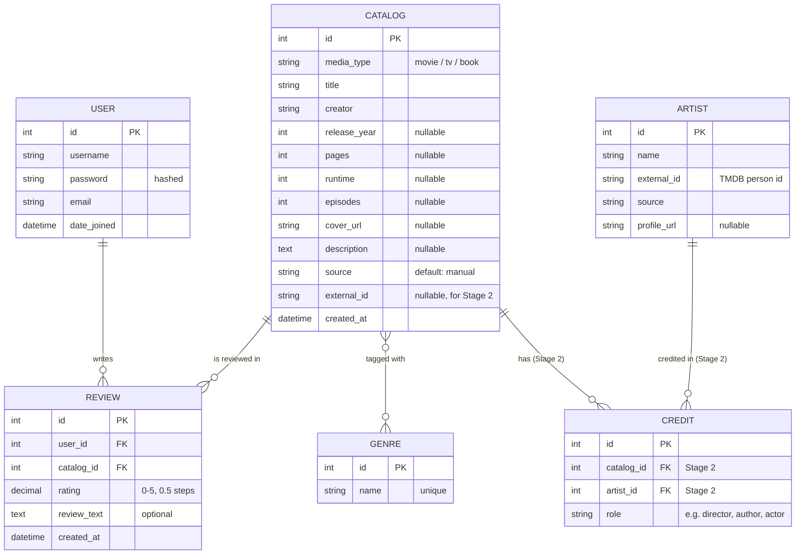

# Design Document — Media Tracker

*A web application for tracking movies, TV shows, and books, with personal ratings and reviews.*

---

## 1. Overview

Media Tracker is a Django web application that lets users record the movies, TV shows, and books they have consumed, rate them, and write reviews. A later phase adds LLM-powered "for you" recommendations driven by each user's rating and review history.

**Product positioning: public + personal, side by side.** The app has two complementary sides. The *personal* side is each user's own media diary — the works they have logged, their ratings and reviews, which they can add, edit, delete, and search. The *public* side is a shared discovery surface — browsing all works and seeing how everyone has rated them. Both are first-class; neither is an afterthought. This dual positioning is why the data model separates the shared, objective `Catalog` from the personal, subjective `Review` from the very start (see §8.2).

The project is built primarily as a hands-on exercise to consolidate backend knowledge (Django ORM, authentication, request lifecycle, layered architecture), while deliberately being engineered to an **industrial-grade** standard rather than a throwaway tutorial. The guiding principle throughout is **design for evolution**: get the core working first, but make no decision that would require a rewrite when later features arrive.

### Goals

- Practice and internalize Django backend fundamentals through a realistic, end-to-end project.
- Model data correctly from the start (shared works vs. per-user records, many-to-many relationships).
- Keep business logic decoupled from the HTTP layer so the system can evolve (external APIs, a different frontend) without rewrites.
- Ship in phases: a working core first, extensibility designed in from day one.

### Non-Goals (for now)

- Not a product intended for public launch. "Already exists in the market" is acceptable and even desirable for a learning project.
- No external API integration in Stage 1 (designed for, but not implemented).
- No custom recommendation engine yet; LLM recommendations are a later phase.
- Visual polish (CSS/styling) is deferred until core functionality is verified.

---

## 2. Tech Stack

| Layer | Choice | Notes |
|---|---|---|
| Backend framework | **Django** | Core learning target. |
| Frontend (Stage 1) | **Django templates** (server-side rendering) | Keeps focus on the backend; no separate build tooling. |
| Frontend (future, optional) | **React** | Only after the backend is stable; would consume a REST API layer grown from the existing monolith. |
| Database (development) | **SQLite** | Django default; zero setup. |
| Database (production, future) | **PostgreSQL** | Standard production choice; migration path already in mind. |
| External data (Stage 2) | **TMDB** (film/TV), **Google Books** (books), **NYT Books** (bestseller lists, planned) | Authoritative metadata sources. |
| Caching (dev) | **Django LocMemCache** | Caches external API lists (e.g. popular feeds) with a TTL. |
| Recommendations (later phase) | **LLM API** | Reads stored ratings/reviews as input. |

---

## 3. Architecture

### Modular Monolith

The system is a **modular monolith**: a single Django project internally divided into focused apps, deployed as one unit.

**Why not microservices or a decoupled frontend/backend from the start?** Those solve for team scale and large-scale operational concerns; for a single-developer learning project they add complexity (cross-service communication, debugging overhead) without payoff. A modular monolith gives clear internal boundaries — enough to practice modular thinking — without that overhead. It also supports the intended "templates first, React later" path: a future API layer can grow out of the clean monolith rather than requiring a rewrite.

### Request Flow

```
Browser  →  config/urls.py (root routing)  →  app/urls.py (feature routing)
         →  view (HTTP concerns)  →  service (business logic)  →  model (ORM)  →  Database
```

Two-level routing: the root `config/urls.py` maps a URL prefix to each app via `include()`; each app's `urls.py` defines its own feature-level paths.

### Layering (View / Service / Model)

A deliberate three-layer separation, mirroring the MVC pattern also found in Spring (`@Controller` / `@Service` / `@Repository`):

| Responsibility | Layer | Analogy (Spring) |
|---|---|---|
| Receive request, return response (HTTP) | **view** | `@Controller` |
| Business logic (no HTTP awareness) | **service** (`services.py`) | `@Service` |
| Data access | **model** (ORM) | `@Repository` |

- **Views** deal only with HTTP: request method, POST data, the current user, which template to render, where to redirect. They stay thin.
- **Services** contain business rules and know nothing about HTTP. They can be called from a web view, a future REST endpoint, a management command, or a test — which makes them reusable and testable.
- **Models** describe the database schema and expose data access via managers (`.objects`).

This separation is what makes the Stage 1 → Stage 2 transition cheap: the switch to external APIs is confined to a single service function (see §8).

---

## 4. Information Architecture (Page Responsibilities)

Each top-level page owns a distinct job. Defining this upfront keeps features from landing in the wrong place as the app grows, and clarifies which stage each page's full form belongs to.

| Page | Job | Perspective | Full form arrives in |
|---|---|---|---|
| **Home** (`/`) | LLM-driven recommendations — a "for you" feed and/or a chat box where the user asks for tailored suggestions | Personalized | Stage 3 |
| **Catalog home** (`/catalog/`) | Public discovery — search (now hits TMDB to add works), eventually a popular / top-rated feed | Public | Discovery feed + filters in Stage 3 (depends on rich API data) |
| **Work detail** (`/catalog/<id>/`) | A single work + everyone's ratings and reviews (public), and the operation hub for the current user's own record (add / edit / delete) | Public + personal | Detail + operation hub done; data enriched as more of Stage 2 lands |
| **My records** (`/reviews/`) | The user's personal diary — everything they've logged, with add / edit / delete / search | Personal | Being built now (Stage 1) |

**Why two list pages (`/catalog/` vs. `/reviews/`).** They look similar but differ in subject: `/catalog/` lists *works* (public, all of them); `/reviews/` lists *the current user's records* (personal, filtered to `request.user`). The public list's subject is `Catalog`; the personal list's subject is `Review`. Keeping them as separate pages in separate apps keeps each responsibility clean.

**Dependency ordering baked into this table.** The advanced public features (filtering discovery by cast/genre/rating) and the LLM home page both require rich, structured data — which only arrives with the external API. So they are correctly sequenced *after* Stage 2, not before. You cannot filter by actor until actors exist in the data.

---

## 5. Application Structure

| App | Responsibility | Owns models? |
|---|---|---|
| `accounts` | Registration, login, logout | No — uses built-in `django.contrib.auth` |
| `catalog` | Works (movies/shows/books), genres, the add/detail flow | `Catalog`, `Genre` |
| `reviews` | User ratings and reviews | `Review` |
| `recommendations` (future) | LLM-driven recommendations | TBD |

**App boundary principle:** each app should map to a responsibility that can be described independently. The most important boundary is `catalog` (objective, shared work data) vs. `reviews` (subjective, per-user records).

Apps are wired together in three places:
1. **`INSTALLED_APPS`** in `settings.py` — registers each app ("powers it on").
2. **URL routing** — the root `urls.py` includes each app's `urls.py`.
3. **Database / foreign keys** — models live in different apps but share one database; foreign keys reference across apps via the `'app.Model'` string form.

---

## 6. Data Model

### Entity-Relationship Diagram



*Note: `USER` is Django's built-in `auth.User` — shown for context but not defined by us. `ARTIST` and `CREDIT` are designed but not implemented in Stage 1 (see §8).*

### Tables

**`auth.User`** (built-in) — Authentication is handled entirely by `django.contrib.auth`. No custom user model in Stage 1. If profile fields (avatar, bio, preferences) are needed later, they will be added via a separate `Profile` model with a `OneToOneField` to `User`, not by modifying the built-in user.

**`Catalog`** — The objective, shared record of a work. One row per work, regardless of how many users reviewed it. Common fields (`title`, `media_type`) are required; medium-specific fields (`pages`, `runtime`, `episodes`) and metadata fields (`creator`, `release_year`, `cover_url`, `description`) are nullable. `source` and `external_id` support future API integration.

**`Genre`** — A standalone table (not hard-coded choices), related to `Catalog` many-to-many, because a work can have multiple genres. Seeded with an initial set via a data migration.

**`Review`** — The bridge between users and works, and the heart of the app. Two foreign keys (`user`, `catalog`), plus `rating`, `review_text`, `created_at`. A `UniqueConstraint(user, catalog)` enforces one review per user per work. Default ordering is newest-first.

**`Artist` / `Credit`** (designed, Stage 2) — A many-to-many between people and works, bridged by `Credit` (which carries a `role` field). Designed upfront in the ERD but not implemented in Stage 1.

---

## 7. Field-Level Notes

### `Catalog`

- `media_type` — `CharField` with `TextChoices` (`movie` / `tv` / `book`). Fixed, small, single-select set → choices hard-coded in code is appropriate.
- `genres` — `ManyToManyField(Genre)`. A work has many genres; a genre has many works. The join table is auto-generated by Django (no extra fields needed on the relationship).
- `creator`, `release_year`, `pages`, `runtime`, `episodes` — Objective metadata. Optional in Stage 1 (user may skip); auto-filled by the API in Stage 2.
- `source` — `TextChoices` (`manual` / `tmdb` / `googlebooks`), defaults to `manual`. Records data provenance; combined with `external_id` for de-duplication.
- `external_id` — External library's unique ID. Empty in Stage 1; used in Stage 2 for de-duplication.
- `created_at` — `auto_now_add=True`, set once on creation.

### `Review`

- `user` — FK to `settings.AUTH_USER_MODEL` (not a direct `User` import), so a future custom user model requires no code changes here.
- `catalog` — FK to `'catalog.Catalog'` (string form, avoids circular imports).
- `on_delete=CASCADE` on both — a review has no meaning without its user or its work, so it is deleted alongside either.
- `related_name='reviews'` on both — enables reverse queries: `user.reviews.all()`, `catalog.reviews.all()` (the latter powers average-rating calculation). The same name on two FKs does not clash because they attach to different models.
- `rating` — `DecimalField(max_digits=2, decimal_places=1)`, range 0–5 enforced by `MinValueValidator(0)` / `MaxValueValidator(5)`, plus a custom `validate_half_step` validator restricting values to 0.5 increments. `DecimalField` (not `FloatField`) is used so the value is stored exactly, without floating-point rounding error. The form exposes it as a dropdown of half-star choices (0, 0.5, … 5.0) rather than a free-text number, so invalid values can't be entered at the source.
- `review_text` — `TextField(blank=True)`. Text fields use `blank` only (no `null`), so "empty" has one representation (`''`).

**`null` vs `blank` rule of thumb:** text fields that are optional use `blank=True` only; non-text fields (numbers, dates) that are optional use both `null=True` and `blank=True`.

---

## 8. Key Design Decisions

Each decision is recorded with its rationale so the reasoning survives for future readers (including a future self with no context).

### 8.1 Use `django.contrib.auth`; do not build a custom User

The built-in `User` already provides username, hashed password, email, and `date_joined`. Rebuilding it would be a weaker, less safe reimplementation. Critically, **passwords must never be stored in a self-made plaintext field** — hashing/salting is a security requirement that the built-in auth handles. Custom fields, if ever needed, go in a separate `Profile` (OneToOne), leaving the built-in user untouched.

### 8.2 Separate `Catalog` (work) from `Review` (user record)

A work is objective and shared (one *Dune* for everyone); a review is subjective and per-user. Storing them together would duplicate work metadata per user and make queries like "average rating" or "who else liked this" impossible. They are linked by a foreign key, which is the correct relational model.

### 8.3 Single `Catalog` table with `media_type`, not multi-table inheritance

Movies, shows, and books share most fields but differ in a few (pages / runtime / episodes). Two options were considered: (A) one table with a `media_type` field and nullable medium-specific fields, or (B) a parent/child inheritance structure. **Chosen: A.** It keeps `Review`'s foreign key pointing at a single table, avoids cross-table joins for common queries, and — decisively — maps cleanly onto the flat JSON that external APIs return in Stage 2. The few empty fields are an acceptable cost.

### 8.4 `Genre` as a many-to-many table, not `TextChoices`

A work can be both Sci-Fi and Drama, so genre cannot be a single-value field. `TextChoices` (a single hard-coded choice) can't express this; a standalone `Genre` table joined many-to-many can. Contrast with `media_type`, which *is* single-select and fixed, and so correctly uses `TextChoices`. **The distinction:** `TextChoices` for fixed, small, single-select sets; a model + M2M when a record relates to many, and the options are themselves data.

### 8.5 Add `external_id` and `source` now, even though unused in Stage 1

De-duplication in Stage 2 relies on the external library's unique ID, not on title string matching. Adding these fields later would require a data migration and back-filling existing rows — expensive. Adding them now costs nothing: Stage 1 leaves `external_id` empty and defaults `source` to `manual`. **Rule applied:** if back-filling a field later is expensive, add it now.

### 8.6 Design `Artist` / `Credit` now, but implement in Stage 2

The artist ↔ work relationship is many-to-many (a director has many films; a film has many people), correctly bridged by a `Credit` table with a `role`. This is *designed* upfront (it lives in the ERD), but *implemented* later. **Rule applied:** unlike `external_id`, adding these tables later is a pure additive operation (two brand-new tables alongside `Catalog`, no changes to existing structure), so it is cheap to defer. In Stage 1, `creator` (a plain text field) suffices. Stage 2's API returns cast/crew data anyway, so building artists then is efficient.

*Note the consistent yardstick behind 8.5 and 8.6: add early only what is expensive to add later.*

### 8.7 Isolate data-fetching in a service layer (`get_or_create_work()`)

The logic for creating/reusing a `Catalog` record lives in `catalog/services.py`, not in the view. In Stage 1 it does a local `get_or_create`; in Stage 2 only this function's internals change (check local first, then call the API). Views, review logic, and templates stay untouched. **This is the single seam between the two stages** — the payoff of keeping business logic out of views.

### 8.8 Enforce `UniqueConstraint(user, catalog)` from the start; use `update_or_create` (upsert)

"One review per user per work" is a core data-integrity rule, not a deferrable edge case. Integrity constraints should be added early — adding them late risks a database already full of violating data that must first be cleaned. Keeping the constraint means the "add entry" flow must handle re-submission by *updating* the existing review rather than erroring — implemented with `Review.objects.update_or_create(...)`. **Rule applied:** data-correctness rules belong in the foundation; features can grow later, but correctness should hold from day one.

### 8.9 Reference `settings.AUTH_USER_MODEL`, not `User` directly

Industrial-standard practice: referencing the setting (rather than importing `User`) means a future switch to a custom user model requires zero changes to the referencing code.

### 8.10 Catalog data source: API-with-caching, not manual entry or a fixed pre-load

Three models were considered:
- **Manual entry** — users type all metadata. Rejected: uncontrolled data quality (three spellings of the same director create three "different" works).
- **Fixed pre-load** — a static imported set. Rejected: too limiting; users' works won't be in it.
- **API-with-caching (chosen for Stage 2)** — on search, check the local `Catalog`; if absent, fetch from TMDB / Open Library, store it (cache), and point the review at it. The second user recording the same work reuses the cached row. `Catalog` becomes an ever-more-complete local mirror.

Stage 1 uses manual entry deliberately — as scaffolding that mimics the Stage 2 shape — while the real de-duplication is solved later via `external_id`. 

Stage 3 decision:

**Corollary — a Catalog row carries no personal meaning.** Because `Catalog` is a
pure mirror, a row's mere existence means only "this work has been cached," never
"someone wants it." All personal/collection semantics live in `Review` (§8.2), not
in "is it in Catalog." This is why "browse = persist" is safe: clicking a poster
(search or artist detail) calls `select_work`, which persists on click by design —
more rows just mean fewer future API calls, and can never pollute recommendations,
lists, or stats, all of which read from `Review`.

### 8.11 Seed genres via a data migration

Initial genre data is loaded through a **data migration** (`RunPython`), not entered by hand. This makes the seed data reproducible, version-controlled, and automatically applied on `migrate` — the industrial way to handle required seed data. (Fixtures were considered but are less automatic.)

### 8.12 De-duplication key: `title` + `media_type` now, `external_id` later

`get_or_create` conditions must be required, stable, always-present fields. `release_year` is nullable, so putting it in the query condition would break de-duplication (a work with a year and the same work without one wouldn't match, creating duplicates). Stage 1 therefore de-duplicates on `title` + `media_type` (both required); precise version-level distinction is deferred to Stage 2's `external_id`, where it is solved correctly. *(Stage 2 status: now implemented — de-duplication keys on `source` + `external_id`.)*

### 8.13 Work detail page as the operation hub; browse public, act logged-in

The work detail page is the single place a user acts on a work. Instead of scattering add/edit/delete controls across list pages, the detail page shows, based on the viewer's state: not logged in → a prompt to log in; logged in but hasn't reviewed → "Add my review"; already reviewed → their rating plus Edit/Delete. The "my records" list is therefore read-only navigation — clicking a title opens the detail page, where the actions live. This keeps each action's view single-purpose (add / change / delete stay distinct) and gives users one predictable place to manage a work.

Two supporting decisions:
- **Public browse, authenticated action.** Search, browse, and viewing a work's detail need no login (`@login_required` is absent from those views); only creating/editing/deleting a review requires it. This matches the public + personal positioning and lowers the barrier to explore before signing up.
- **Select persists first, then routes to detail.** Selecting a movie from TMDB search first calls `get_or_create_work` to persist (cache) the `Catalog` row, then redirects to that work's detail page by `pk`. Because the work is guaranteed to exist by then, the downstream "add my review" view takes the work's `pk` (not a TMDB id) and does not re-fetch — TMDB fetching lives only in the select step, keeping the rating step purely internal.

### 8.14 Artist detail reads live from TMDB, not from the local library

Clicking a person shows their *full* filmography, so the data source is TMDB's
`combined_credits` endpoint (live), not the local `Credit` table. This is the
deliberate inverse of the planned cast **discovery filter** (§9 Stage 3), which
will read from the local library (`Catalog` filtered by `credit__artist`) to show
only already-collected works. Same entity (`Artist`), opposite data source:
"everything this person made" is a catalog-browsing act (TMDB); "which of my works
feature this person" is a library-filtering act (local DB). Layering follows the
Stage 2 pattern: `get_artist` (client) fetches; `_merge_crew` (service) dedupes
crew by `(id, media_type)` and collapses multiple jobs into one entry.

### 8.15 Composite index on Catalog (title, media_type)

`_resolve_external_id` (recommendation click-through) looks up a work by exact
title + media_type, a high-frequency query on a table that grows over time (the
Catalog mirror, §8.10). A composite index `(title, media_type)` serves it:
title first because it's the high-selectivity column (leftmost-prefix rule also
lets this same index cover title-only exact lookups, so no separate title index
is needed). Added while the table is small — cheap now, avoids a slow-query
scramble and a lock-heavy index build later (same "add early what's expensive
later" yardstick as §8.5). Note this index does NOT help the `icontains`
searches (my_records, catalog search): a leading-wildcard `LIKE '%x%'` can't use
a B-tree index — those would need full-text search, deferred until table size
warrants it (and my_records is pre-filtered by user to a tiny set anyway).

---

## 9. Phased Delivery

The core strategy: **build Stage 1 to look like Stage 2's shape**, so the transition changes as little code as possible. The user's primary action in both stages is *writing a review*; the catalog record is a by-product.

### Stage 1 — Working core (manual data) — *complete*

- **Data source:** manual entry.
- **`accounts`:** registration, login, logout (built-in auth + custom registration view + templates).
- **`catalog` — add entry:** one form collects both work info (media_type, title, genres) and review info (rating, review_text). On submit, the view calls `get_or_create_work()` to create/reuse the `Catalog` row, associates genres, then upserts a `Review`.
- **`catalog` — detail:** shows a work, its average rating (reverse query + `Avg` aggregation), and all its reviews.
- **Known limitation:** data quality is imperfect (possible duplicate works from manual entry), accepted in exchange for full command of Django fundamentals.

The personal side (my records: list, edit, delete, search) is being completed within Stage 1. The public discovery side has its foundation in Stage 1 (the work detail page) but its richer form depends on later stages, as the roadmap below reflects.

### Stage 2 — External API integration — *in progress*

**Done:**
- `catalog/clients.py` — a dedicated API-client layer with a low-level `_tmdb_get` helper shared by all TMDB calls, plus `_google_books_get` for books. Each wraps `timeout`, `raise_for_status`, and `try/except` returning a safe fallback so a failed API call degrades gracefully.
- `get_or_create_work()` rewritten: check local `Catalog` by `source` + `external_id` first, reuse if found; otherwise dispatch by `media_type` to a per-medium mapper (`_map_movie` / `_map_tv` / `_map_book`), then store. The seam held — views/templates/review logic did not change shape.
- De-duplication uses `source` + `external_id`, not title matching.
- API keys (TMDB, Google Books) via `.env` + `python-dotenv`, git-ignored, `.env.example` committed.
- Three media types fully wired: movies & TV (TMDB), books (Google Books) — search → select → detail → rate, with a media-type selector on search.
- Genre mapping per source (TMDB genre objects; Google Books `categories` paths split on `/`), with dirty legacy data cleaned.
- `upsert_review` service extracted (shared by add and edit).
- `Artist` / `Credit` (cast/crew/authors).

### Stage 3 — Discovery and recommendations — *in progress*

> **LLM recommendations** have their own design doc: [llm_design.md](./llm_design.md).

**Done:**
- **Catalog home as a discovery surface**: the home page now shows TMDB "popular movies" and "popular TV" poster walls (via `/movie/popular`, `/tv/popular`), replacing the old in-library list. Each poster links into the select → detail flow. Book discovery (no popular endpoint on Google Books) is planned via the NYT Bestseller API.
- **Response caching**: popular lists are cached (`cache.get`/`cache.set`, 1-hour TTL, `LocMemCache` in dev) so the home page hits TMDB roughly once an hour instead of on every load.
- **Artist detail page**: Click a person's photo → full TMDB filmography.
  - `get_artist` (client) fetches `combined_credits`; returns cast + crew.
  - `_merge_crew` (service) dedupes by `(id, media_type)`, collapses multiple jobs into one entry.
  - Cast/crew shown in two blocks; posters link into `select_work` (fetch-on-click persistence).
- **Discovery filters** (genre): search popular movie and tv by genre.

**Planned:**
- **Discovery filters** (cast / rating) — planned; implement in review app.
- **Home page as the LLM surface** — planned.
- **`recommendations` app** — planned.
- **wishlist model**

### Even later / optional

- Possible React frontend (backend grows a REST API layer).

---

## 10. Implementation Status

| Item | Status |
|---|---|
| Authentication (built-in `auth.User`) | ✅ Implemented |
| `accounts` — register / login / logout | ✅ Implemented |
| `Catalog` model | ✅ Implemented |
| `Genre` model + M2M + seed migration | ✅ Implemented |
| `Review` model (with `UniqueConstraint`) | ✅ Implemented |
| `catalog` service layer (`get_or_create_work`) | ✅ Implemented |
| Add-entry flow (create work + genres + upsert review) | ✅ Implemented |
| Work detail page (work + average rating + reviews) | ✅ Implemented |
| Public catalog list page (all works, at `/catalog/`) | ✅ Implemented |
| Public catalog search (`?q=` title match) | ✅ Implemented |
| Personal "my records" list (at `/reviews/`) | ✅ Implemented |
| Edit my review (rating + text) | ✅ Implemented |
| Delete my review (POST + confirm page) | ✅ Implemented |
| Search my records (`?q=` title match) | ✅ Implemented |
| Half-star rating (0–5, 0.5 steps, `DecimalField`) | ✅ Implemented |
| Detail page as operation hub (add/edit/delete by viewer state) | ✅ Implemented |
| `upsert_review` service (reviews) | ✅ Implemented |
| TMDB API client layer (`catalog/clients.py`) | ✅ Implemented |
| TMDB movie search → select → detail → rate flow | ✅ Implemented |
| `external_id` + `source` de-duplication (all media) | ✅ Implemented |
| `Artist` / `Credit` | ✅ Implemented |
| External API — TV shows (`/search/tv`) | ✅ Implemented |
| External API — books (Google Books) | ✅ Implemented |
| Genre mapping from API | ✅ Implemented |
| Catalog home as discovery surface (popular movies + TV feeds) | ✅ Implemented |
| Response caching for external API lists | ✅ Implemented |
| Book discovery via NYT Bestseller API | ⬜ Not yet |
| Discovery filters (genre) — *Stage 3* | ✅ Implemented |
| Artist detail page (TMDB combined_credits, cast + crew) | ✅ Implemented |
| Discovery filters (cast / rating) — *Stage 3* | ⬜ Not yet |
| LLM recommendations / chat (home page) — *Stage 3* | 💭 Depends on Stage 2 |
| React frontend | 💭 Possible future |

*Legend: ✅ implemented · 🚧 in progress · ⬜ planned, not started · 📐 designed, not implemented · 💭 future / blocked on earlier stage*

---

## 11. Engineering Principles

Principles that guided the decisions above and should guide future ones:

- **Design vs. implementation are distinct.** Deferred features (e.g. `Artist`) still appear in the ERD upfront. Designing something is not the same as building it.
- **Add early only what is expensive to add later.** Fields needing back-fill (`external_id`) go in now; pure-additive tables (`Artist`) can wait. The same yardstick decides both.
- **Data-correctness rules belong in the foundation.** Integrity constraints (`UniqueConstraint`) are added from the start, before violating data can accumulate.
- **Keep business logic out of the HTTP layer.** Logic lives in services, keeping views thin, testable, and reusable — and creating a single seam for future change.
- **Don't rebuild what the framework provides.** Authentication, forms, generic views, and the ORM are used rather than reimplemented.
- **Phased delivery: make it work, then make it good.** A working core first; extensibility designed in from day one; polish and enrichment later.
- **Reproducible everything.** Seed data via migrations, so any clone of the project reaches the same state with `migrate`.