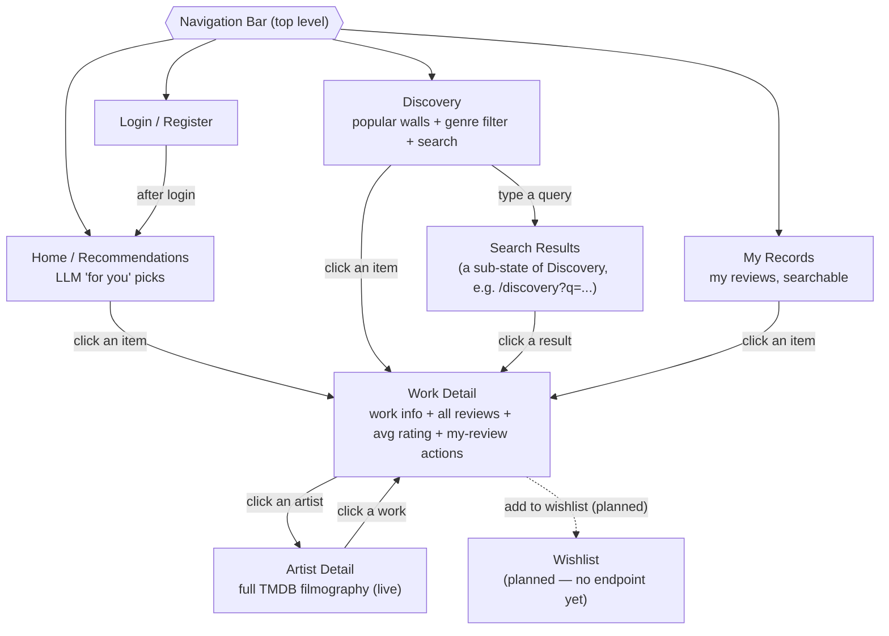

# Frontend Page Map & Endpoint Plan

*Navigation structure of the planned React frontend, and the API endpoints each page needs. Companion to `design.md` (§ 8.16) and `llm_design.md`.*

---

## 1. Navigation & Page Flow

**Reading the map:**
- **Four top-level pages** switched via the nav bar: Home/Recommendations, Discovery, My Records, Login/Register.
- **Work Detail** is a shared hub — reachable from Home, Discovery, Search Results, and My Records. (Mirrors `design.md` §8.13: the detail page is the single place to act on a work.)
- **Artist Detail ↔ Work Detail** form a loop: from a work you open an artist, from an artist you open another work.
- **Search Results** is not a separate nav destination — it's a state of Discovery (query param drives it), the same "params drive one page's two states" pattern used by `?q=` on My Records.
- **Wishlist** is *designed, not implemented* (dashed) — same design-vs-implementation split as Artist/Credit in `design.md` §8.6. No stub endpoint: an empty endpoint the frontend codes against is worse than none.

---

## 2. Per-Page Endpoint Plan

Legend: **✓** exists · **NEW** to build · **(planned)** future, not now.

### Home / Recommendations
| Need | Endpoint | Status |
|---|---|---|
| Generate recommendations from free-text intent + media types | `POST /api/recommendations/` (body: query, media_types) | ✓ |
| (optional) popular walls if Home doubles as discovery | see Discovery | — |
| Click a recommendation → open the work | resolve title→id, then Work Detail (see note) | NEW |

> **Note — recommendations return title strings, not ids.** Clicking a rec needs the "title → TMDB search → id → persist" step (`design.md`/`llm_design.md` TODO ④). Either the recommendations endpoint resolves ids server-side, or a separate `POST /api/catalog/resolve/` does it on click. Decide when building.

### Discovery (includes Search as a sub-state)
| Need | Endpoint | Status |
|---|---|---|
| Popular movies / TV walls | `GET /api/catalog/popular/` (or `/discover/`) | ✓ |
| Filter by genre | `GET /api/catalog/?genre=...` (or `/discover/?genre=`) | ✓ |
| Search to add works (hits TMDB) | `GET /api/catalog/search/?q=...` | ✓ |
| Click an item / result → open the work | Work Detail | ✓ |

> HTML currently renders the popular walls server-side (no API). React needs a real endpoint. Search hits TMDB (distinct from the local DB — `/search` vs `/discover`, per Stage 3 notes).

### My Records
| Need | Endpoint | Status |
|---|---|---|
| List my reviews | `GET /api/reviews/` | ✓ |
| Search my reviews | `GET /api/reviews/?q=...` | NEW (add `q` filter to existing) |
| Edit / delete a review | `PATCH` / `DELETE /api/reviews/<pk>/` | ✓ |
| Click an item → open the work | Work Detail | — |

### Work Detail
| Need | Endpoint | Status |
|---|---|---|
| Work info (title, metadata, cover, genres) | `GET /api/catalog/<id>/` | ✓ |
| All reviews for this work + average rating | `GET /api/catalog/<id>/reviews/` **or** nested in the detail response | ✓ |
| Add / edit / delete my review | `POST` / `PATCH` / `DELETE /api/reviews/...` | ✓ |
| Click an artist → open Artist Detail | Artist Detail | ✓ |

> **Design decision (defer to build time):** do work-info and its reviews come as **one packed response** (`/api/catalog/<id>/` includes reviews + avg) or **two endpoints** (info first, reviews/paged separately)? Packed = simpler; split = info shows instantly, reviews load/paginate after. Also: compute `avg` server-side and include it, or let the client compute from the review list?

### Artist Detail
| Need | Endpoint | Status |
|---|---|---|
| Artist + full filmography (live TMDB `combined_credits`) | `GET /api/artists/<id>/` | ✓ |
| Click a work → open Work Detail | Work Detail (may need resolve/persist if not in local Catalog) | ✓ |

> Reads **live from TMDB**, not the local library (`design.md` §8.14). Works in the filmography may not be in local Catalog yet — clicking one needs the same persist-on-click step as search/recommendations.

### Login / Register
| Need | Endpoint | Status |
|---|---|---|
| Login (credentials → token) | `POST /api/token/` | ✓ |
| Register a new user | `POST /api/register/` | NEW (handle password via Django's create_user — never plaintext, `design.md` §8.1) |
| Logout (invalidate token) | client drops token, or a delete-token endpoint | NEW (decide) |

> A separate-origin SPA will also need **CORS** (`django-cors-headers`) and possibly a token-refresh story — configure when React actually starts calling across origins, not before.

### Wishlist — *(planned, not built)*
No endpoints yet. When built, likely `GET/POST/DELETE /api/wishlist/` backed by a new `Wishlist` model (see the wishlist TODO). Kept on this map only to reserve its place in the navigation.

---

## 3. Endpoint Build Order (suggested)

1. **Catalog read** (`GET /api/catalog/<id>/`, `/popular/`, `/search/`) — most pages depend on browsing works.
2. **Work-detail reviews** (`/api/catalog/<id>/reviews/` + avg) — completes the detail page.
3. **Recommendations** (`POST /api/recommendations/`) — a single action endpoint (not CRUD; use `APIView`, calls `get_recommendations`).
4. **Artist** (`GET /api/artists/<id>/`) — calls `get_artist`.
5. **My-records search** (`?q=` on reviews) — small addition.
6. **Register** — careful with password handling.
7. **CORS / logout / token refresh** — when React begins cross-origin calls.
8. **Wishlist** — after the feature is designed.

Each endpoint reuses an existing service where one exists (`get_or_create_work`, `get_recommendations`, `get_artist`, `upsert_review`) — the API view stays thin, per `design.md` §8.16.